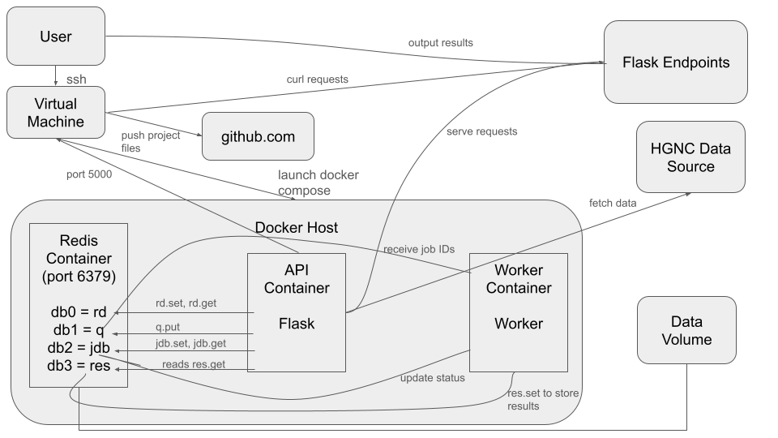

# Homework 08: HGNC Gene Approval Date Analysis API

***Project Overview:***

This project is a Flask API that fetches, processes, and provides access to comprehensive human gene data from the HGNC (Human Gene Nomenclature Committee) complete dataset. It incorporates asynchronous job processing to handle long-running tasks and uses Redis for persistent data storage.
The API supports the following functionalities:
1. Fetches the HGNC JSON data from a remote source and loads it into Redis
2. Retrieves all gene records stored in Redis
3. Clears all gene data from Redis
4. Returns a JSON-formatted list of all gene IDs (hgnc_id)
5. Retrieves detailed information for a specific gene based on its hgnc_id                                                                                  
6. Accepts job requests in JSON format to process a specified range of gene IDs                                                                             
7. Provides an endpoint to list all submitted job IDs stored in the jobs database                                                                           
8. Allows retrieval of detailed information and current processing status for a specific job using its unique job ID                                        
9. Uses a dedicated worker service that listens on a Redis-backed queue, picks up submitted jobs, simulates processing, and updates the job status accordingly                                                                                                                                                          
10. Stores analysis results in a separate Redis database

***Python Scripts:***                                                                                                                                       
* ```src/api.py```
  - Implements the Flask API endpoints:
    + Loads gene data from the HGNC dataset into Redis
    + Retrieves and deletes gene records
    + Submits and views jobs via the Jobs API
* ```src/jobs.py```
  - Contains core functionality for job management
  - Does the following tasks:
    + Generates unique job IDs
    + Validates job input
    + Stores job data in Redis
    + Pushes job IDs onto the Redis queue
    + Provides functions to retrieve job info and save/retrieve results
* ```src/worker.py```
  - Worker script that continuously listens to the Redis queue
  - Updates job status to in progress, retrieves the specified HGNC range, parses each gene’s date_approved_reserved, and computes:
    + total_genes processed
    + earliest_date and latest_date
    + yearly_breakdown of approvals
    - Saves the results in Redis and updates job status to complete


***Data:***                                                                                                                                                                                                                                                                                                             

The gene data is sourced from the HGNC complete dataset provided by the Human Gene Nomenclature Committee.

It is available in JSON and TSV formats at:

[https://storage.googleapis.com/public-download-files/hgnc/json/json/hgnc_complete_set.json](https://storage.googleapis.com/public-download-files/hgnc/json/json/hgnc_complete_set.json)
                                                                                                                                                          
[https://storage.googleapis.com/public-download-files/hgnc/tsv/tsv/hgnc_complete_set.txt](https://storage.googleapis.com/public-download-files/hgnc/tsv/tsv/hgnc_complete_set.txt)                                                                                                                                                                                                                                                                                                  
                                                                                                                                                            
This dataset contains comprehensive and up-to-date information on human genes, including:
* **hgnc_id:** A unique identifier assigned by HGNC
* **symbol:** The official gene symbol
* **name:** The full gene name
* **location:** Chromosomal location data
* **Other Attributes:** Additional identifiers (e.g., Ensembl ID, RefSeq accession), gene groupings, status, etc.


***Deploying the App:***
1. Navigate to the Project Directory
2. Create and start docker containers (Flask, Redis & Worker):
   ```docker-compose up --build -d```
   - The Flask API will run locally at http://localhost:5000

**OR (pull directly from DockerHub):**
1. ```docker pull vigneshwinner/gene_orchestration:1.0```
2. ```docker run -p 5000:5000 vigneshwinner/gene_orchestration:1.0```


***Accessing the Flask API:***

Once the API is running, to access and test the endpoints:

* ```curl -X POST http://127.0.0.1:5000/data```
  - Loads the HGNC gene data into Redis
* ```curl http://127.0.0.1:5000/data```
  - Retrieves all the gene records stored in Redis
* ```curl -X DELETE http://127.0.0.1:5000/data```
  - Clears all gene data from Redis
* ```curl http://127.0.0.1:5000/genes```
  - Returns a list of all gene IDs (hgnc_id)
  - Example Output:
    + ```["5", "37133", "24086", "7", ...]```
* ```curl http://127.0.0.1:5000/genes/<hgnc_id>```
  - Retrieves detailed gene data for a specific gene
  - Example Output:
    + ```{"hgnc_id": "HGNC:5", "symbol": "A1BG", "name": "alpha-1-B glycoprotein", "location": "19q13.43", ...}```
* ```curl localhost:5000/jobs -X POST -d '{"hgnc_id_start": "<hgnc_id>", "hgnc_id_end": "<hgnc_id>"}' -H "Content-Type: application/json"```
  - Submits a job that will process a range of gene IDs, returning a JSON object with the job’s unique id and initial status of "submitted"
* ```curl localhost:5000/jobs```
  - Returns a list of job IDs
  - Example Output:
    + ```{"jobs": ["a1b2c3d4-5e6f-7g8h-9i10-jk11lm12no13", "<another-job-id>", ...]}```
* ```curl localhost:5000/jobs/<job_id>```
  - Returns job details for a specific job
  - Example Output:
    + ```{"id": "a1b2c3d4-5e6f-7g8h-9i10-jk11lm12no13", "status": "complete", "hgnc_id_start": "HGNC:5", "hgnc_id_end": "HGNC:10000"}```
* ```curl localhost:5000/results/<job_id>```
  - Returns earliest/latest date, total genes, and yearly breakdown of gene approval dates
  - Example Output:
    + ```{"earliest_date": "01/01/1986", "latest_date": "03/17/2005", "total_genes": 78, "yearly_breakdown": {"1986": 8, "1988": 2, "1989": 3, "1990": 2, "1991": 3, "1992": 4, "1993": 1, "1994": 4, "1995": 4, "1996": 6, "1997": 8, "1998": 2, "1999": 28, "2000": 1, "2001": 1, "2005": 1}}```


***Running Containerized Unit Tests***
1. Start containers (if not running): ```docker-compose up --build -d```
2. Run unit tests inside container: ```docker-compose exec flask-app pytest test```

* **test_api.py:** Validates all Flask endpoints
* **test_worker.py:** Checks date parsing and ID-range logic
* **test_jobs.py:** Ensures job creation, storage, and results persistence


***Software Diagram***



The system runs on a Docker host that orchestrates three containers: Redis, API (Flask), and Worker via docker-compose. The Flask app exposes HTTP endpoints on port 5000, fetching raw HGNC data from the public JSON source and storing it in Redis (db0). Users submit asynchronous “jobs”, and these job IDs are pushed onto a Redis-backed queue (db1) and persisted in the jobs database (db2). A separate Worker container pulls job IDs off the queue, updates their status in db2, computes the analysis, and writes results to Redis (db3). A mounted host volume ensures Redis snapshots persist across restarts.
